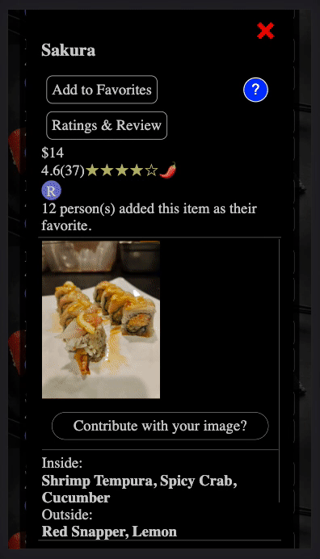

<h1 align="center">Hanabi Sushi Online Menu</h1>

<h1 align="center">
   
    
    <h3 align="center">
        Mobile Menu for Hanabi Sushi Designed by Wooseok Jang
       
    </h3>
</h1>

<h3>Excalidraw design of my application</h3>
https://excalidraw.com/#room=b1525fb6d8294cb2a369,TCNXX2A_E6fLPWzEAX2n1g

<h3>Website Link:</h3>
*Designed only for mobile.
http://hanabimenu.com/

<h3>QR Code:</h3>

<h2>Features</h2>

  

    <h3>Instructions</h3>
  

  
  <ul>
    <li>Will only appear on first visit or on click of instruction button.</li>
    <li>Contains all instructions for user to use the app efficiently.</li>
    <li>Contains short Gifs that demonstrates how to use a feature by pages.</li>
    <li>Buttons to navigate pages for instructions.</li>
  </ul>

  
<h3>Select Allergies</h3>

  
  <ul>
    <li>Displays all ingredient in the database.</li>
    <li>User may select them to add to their allergy list.</li>
    <li>This will help users to see the menus they are allergic to.</li>
    <li>It will also help users to see selected menu without allergic ingredients.</li>
  </ul>

  

    <h3>Search</h3>
  

  
  <ul>
    <li>User can search the data base with an input</li>
    <li>Search input will search the DB that matches/contains input string in name, ingredients or keywords of the recipe.</li>
    <li>Searching with an input will render all menus related to the input.</li>
  </ul>

  

    <h3>Favorites</h3>
  

  
  <ul>
    <li>User may add menus to their favorite</li>
    <li>User will able to see the favorites render in favorites list.</li>
    <li>Recipes in database will also collect data to see how many users added the menu to their favorites.</li>
  </ul>

  

    <h3>Helper for icons</h3>
  

  
  <ul>
    <li>This component displays icon and it's description.</li>
    <li>User can see what icons are meant.</li>
  </ul>

  

    <h3>All you can eat selection.</h3>
  

  
  <ul>
    <li>User can select either AYCE(all you can eat) or A La Carte.</li>
    <li>Each selection will change the way of displaying menu list.</li>
  </ul>

  

    <h3>Type displays</h3>
  

  
  <ul>
    <li>User will see all types of menu render on their screen.</li>
    <li>User can click on type and it will show all menus that is associated with the menu type.</li>
    <li>Clicking type will also scroll so that user can see the top of the list.</li>
    <li>It will also display sorting component.</li>
  </ul>

  

    <h3>Sorting</h3>
  

  
  <ul>
    <li>User can select sorting method.</li>
    <li>
      Sorting methods are:
      <ul>
        <li>Alphabetical A to Z or Z to A</li>
        <li>Price Low to High or High to Low</li>
        <li>Ratings Low to High or High to Low</li>
        <li>Favorites count High to Low</li>
      </ul>
    </li>
  </ul>

  

    <h3>Menu List</h3>
  

  <ul>
    <li>Each menu entry will be display under the menu type.</li>
    <li>
      Each menu will be displayed with its details.
      <ul>
        <li>Name</li>
        <li>Price</li>
        <li>Rating</li>
        <li>Icons</li>
      </ul>
    </li>
    <li>
      Each menu will also come with buttons
      <ul>
        <li>Reviews</li>
        <li>Details</li>
      </ul>
    </li>
  </ul>

  

    <h3>Reviews</h3>
  

  
  <ul>
    <li>Users can see all the reviews that has been made.</li>
    <li>Users can also write their own review with an rating.</li>
    <li>Each review can be clicked with helpful, It will change the way reviews are rendered.(It will display reviews with more helpful votes first.)</li>
    <li>Each review also can be reported for management team to review.(can also deleted)</li>
    <li>Each review will also display when review was made by timeago format.</li>
  </ul>

  

    <h3>Menu Details</h3>
  

  
  <ul>
    <li>It will display all details to the recipe.</li>
    <li>It also shows images for the menu.</li>
    <li>Can also see how many users added selected menu to their favorites.</li>
    <li>Users are also allowed to contribute their images for the menu.(will be reviewed by management team before updated)</li>
    <li>It will also show you what you are allergic to that menu contains and it will display menu details w/o allergic item.</li>
    <li>
      Contains buttons:
      <ul>
        <li>Add/remove to/from favorites (will save/remove to/from user's favorite)</li>
        <li>Rating & Review (will display reviews page for current menu)</li>
      </ul>
    </li>
  </ul>

